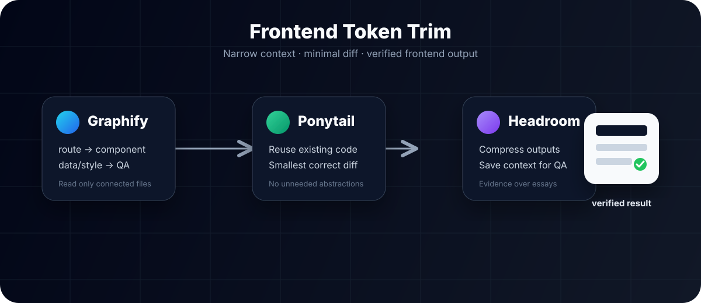
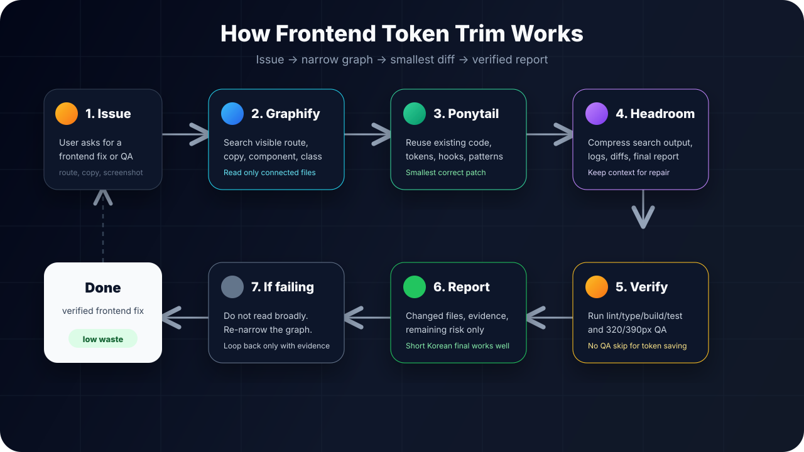
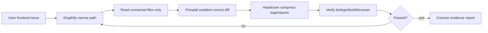

# Frontend Token Trim Skillpack

<p align="center">
  
</p>

<p align="center">
  <strong>Token-efficient frontend agent workflow</strong><br>
  <span>Graphify the path · Ponytail the diff · Keep Headroom for QA</span>
</p>

<p align="center">
  <a href="https://github.com/kimyoungwopo/frontend-token-trim-skillpack/blob/main/LICENSE"></a>
  
  
  
  
  
</p>

<p align="center">
  <a href="#quick-start">Quick Start</a> ·
  <a href="#how-it-works">How it works</a> ·
  <a href="#why-it-works">Why</a> ·
  <a href="#benchmark">Benchmark</a> ·
  <a href="#agent-support">Agent Support</a> ·
  <a href="docs/ko.md">한국어</a> ·
  <a href="docs/en.md">English</a> ·
  <a href="docs/ja.md">日本語</a>
</p>

---

## What is this?

**Frontend Token Trim** is a small skillpack for frontend coding agents. It reduces wasted context by forcing the agent to:

<table>
<tr>
<td width="33%">

### 1. Graphify

Map the narrow code path before reading broadly.

```txt
route → component → data/style → QA
```

</td>
<td width="33%">

### 2. Ponytail

Reuse existing code and make the smallest correct diff.

```txt
existing first → no broad refactor
```

</td>
<td width="33%">

### 3. Headroom

Compress logs/reports and save context for verification.

```txt
evidence > essays
```

</td>
</tr>
</table>

## Quick Start

### Hermes Agent

```bash
git clone https://github.com/kimyoungwopo/frontend-token-trim-skillpack.git
cd frontend-token-trim-skillpack
./install.sh
```

Then start a new Hermes session and ask:

```txt
frontend-token-trim 적용해서 이 프론트엔드 이슈 고쳐줘.
```

### Codex / Claude / OpenClaude

Copy the matching rule file into your project root:

```bash
# Codex / OpenAI coding agents
cp templates/AGENTS.md /path/to/your-project/AGENTS.md

# Claude Code / Claude-style agents
cp templates/CLAUDE.md /path/to/your-project/CLAUDE.md

# OpenClaude / OpenClaude-style agents
cp templates/OPENCLAUDE.md /path/to/your-project/OPENCLAUDE.md
```

Or paste the portable contract:

```txt
Apply Frontend Token Trim:
1) Graphify the narrow route/component/data/style path first.
2) Reuse existing components, hooks, API clients, styles, and tokens.
3) No new dependencies or broad refactors unless the current path proves they are necessary.
4) Touch the fewest files that fix the real flow.
5) Verify exact affected route plus 320/390 mobile overflow; include command/screenshot evidence.
6) Final report: changed files, verification result, remaining risk only.
```

## How it works

<p align="center">
  
</p>



| Step | Agent behavior | Token-saving effect |
|---|---|---|
| 1. Issue intake | Use route, visible copy, screenshot, error, or component clue | Avoid vague repo browsing |
| 2. Graphify | Map `route → component → hook/API/state → style/token → QA target` | Fewer files read |
| 3. Ponytail | Reuse existing components/hooks/tokens and patch locally | Fewer files changed |
| 4. Headroom | Compress search results, logs, diffs, and final report | More context left for QA |
| 5. Verify | Run the smallest relevant checks and 320/390px visual QA when needed | Savings do not skip correctness |
| 6. Repair loop | If verification fails, re-narrow the graph instead of expanding blindly | Prevents retry bloat |

## Why it works

| Common token leak | What this pack changes |
|---|---|
| Agent reads `app/`, `components/`, `lib/` too broadly | Searches visible route/copy/class names first |
| New helper/component/token gets created too early | Existing project pattern wins by default |
| Small UI fix turns into a refactor | Fewest necessary files only |
| Logs, diffs, and summaries flood context | File map + exact evidence only |
| “Done” is claimed before mobile QA | Requires command/browser/viewport evidence |

## Benchmark

<p align="center">
  <strong>Controlled result on a localized mobile overflow task</strong>
</p>

| Mode | Estimated tokens | Files read | Files changed | Verification |
|---|---:|---:|---:|---|
| Baseline broad browsing | 2,489 | 38 | 1 | lint, 390px browser |
| Frontend Token Trim | 496 | 4 | 1 | lint, 320px + 390px browser |

<p align="center">
  
</p>

Read the full method:

- [Token Usage Benchmark](docs/benchmark.md)
- [Controlled Benchmark Result](docs/benchmark-result-controlled.md)

Run your own estimate:

```bash
python3 scripts/estimate_tokens.py baseline-transcript.txt token-trim-transcript.txt
```

> Exact provider billing can differ by model/tokenizer. Use provider or agent usage logs when available.

## Agent Support

| Environment | Support | How to apply |
|---|---|---|
| Hermes Agent | Native skillpack | `./install.sh` |
| OpenAI Codex / Codex CLI | Repo rules | `templates/AGENTS.md` |
| Claude Code / Claude-style agents | Repo rules | `templates/CLAUDE.md` |
| OpenClaude / OpenClaude-style agents | Repo rules | `templates/OPENCLAUDE.md` |
| Gemini-style coding agents | Prompt-compatible | Paste `templates/frontend-token-trim.md` |
| OpenCode / terminal agents | Prompt-compatible | Paste contract + explicit verification commands |
| Non-tool chat models | Limited | Useful as checklist; no automatic file/test/browser QA |

Best results require file search, targeted reads, edits, lint/type/build/test execution, and browser/screenshot QA for visual frontend work.

## Installed Skills

| Skill | Purpose | Prevents |
|---|---|---|
| [`ponytail`](skills/software-development/ponytail/SKILL.md) | Minimal correct implementation | Overengineering, new deps, unneeded abstractions |
| [`graphify`](skills/software-development/graphify/SKILL.md) | Narrow code-path mapping | Repo-wide browsing, wrong-layer fixes |
| [`headroom`](skills/software-development/headroom/SKILL.md) | Context/output budgeting | Long logs, giant summaries, no room for QA |
| [`frontend-token-trim`](skills/software-development/frontend-token-trim/SKILL.md) | Combined frontend workflow | Unfocused frontend agent loops |

## Documentation

<table>
<tr>
<td width="33%">

### 한국어

설치, 사용법, 모델 지원, 토큰 비교 설명.

[Read KO docs →](docs/ko.md)

</td>
<td width="33%">

### English

Usage, benefits, support matrix, benchmark method.

[Read EN docs →](docs/en.md)

</td>
<td width="33%">

### 日本語

概要、使い方、モデル対応、比較方法。

[Read JA docs →](docs/ja.md)

</td>
</tr>
</table>

## Repository Layout

```txt
skills/software-development/
  ponytail/
  graphify/
  headroom/
  frontend-token-trim/
docs/
  ko.md
  en.md
  ja.md
  benchmark.md
  benchmark-result-controlled.md
assets/
  frontend-token-trim-flow.svg
scripts/
  estimate_tokens.py
templates/
  AGENTS.md
  CLAUDE.md
  OPENCLAUDE.md
  frontend-token-trim.md
install.sh
README.md
LICENSE
```

## Notes

- Existing same-name Hermes skills are backed up by `install.sh` as `<skill>.backup-YYYYMMDD-HHMMSS`.
- `ponytail` is MIT-adapted from DietrichGebert/ponytail; see [`SKILL.md`](skills/software-development/ponytail/SKILL.md) and [`NOTICE.md`](NOTICE.md).
- This pack does not change your model, pricing, or context window. It changes **how the agent spends context**.

## License

MIT. Third-party attribution is listed in [`NOTICE.md`](NOTICE.md).
