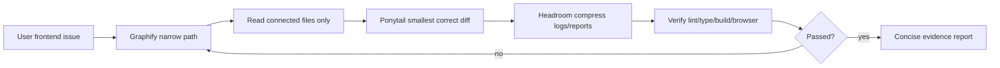

# Frontend Token Trim Skillpack — English

[← README](../README.md) · [한국어](ko.md) · [日本語](ja.md) · [How it works](#how-it-works)

## One-line summary

A Hermes Agent skillpack that combines **Ponytail + Graphify + Headroom** so frontend agents read less, edit less, and verify more precisely.

## How it works

<p align="center">
  
</p>



| Step | Agent behavior | Token-saving effect |
|---|---|---|
| 1. Issue intake | Use route, visible copy, screenshot, error, or component clue | Avoid vague repo browsing |
| 2. Graphify | Map `route → component → hook/API/state → style/token → QA target` | Fewer files read |
| 3. Ponytail | Reuse existing components/hooks/tokens and patch locally | Fewer files changed |
| 4. Headroom | Compress search results, logs, diffs, and final report | More context left for QA |
| 5. Verify | Run the smallest relevant checks and 320/390px visual QA when needed | Savings do not skip correctness |
| 6. Repair loop | If verification fails, re-narrow the graph instead of expanding blindly | Prevents retry bloat |

## What improves?

Frontend tasks usually waste tokens on unnecessary exploration, raw logs, and rework — not on the final patch. This pack changes the workflow.

| Problem | Improvement |
|---|---|
| Reading whole `app/` or `components/` trees too early | Search route/copy/component and map the narrow path first |
| Creating new helpers/components/tokens unnecessarily | Reuse existing project patterns first |
| Small UI fix becomes a broad refactor | Touch the fewest files that fix the real flow |
| Raw search results/logs/diffs flood the chat | Compress to a file map and actionable evidence |
| Context runs out before QA | Reserve headroom for browser/mobile verification and repair |

## Token comparison

You can compare token usage by running the same frontend task twice.

```txt
A. baseline: normal frontend instruction
B. frontend-token-trim: same instruction + Frontend Token Trim contract
```

Use provider/agent usage logs for exact input/output/total tokens when available. If you only have transcripts, use the approximate estimator:

```bash
python3 scripts/estimate_tokens.py baseline-transcript.txt token-trim-transcript.txt
```

See [Token Usage Benchmark](benchmark.md) for the full method.

## Installed skills

### `ponytail`

- YAGNI
- existing code first
- native HTML/CSS/platform features first
- avoid new dependencies
- shortest correct diff

Prevents over-engineering, duplicate helpers, unnecessary abstractions, and broad refactors.

### `graphify`

Builds a small code-path map before implementation.

```txt
route/page → component → hook/API/state → style/token → QA target
```

Example:

```txt
/app/(member)/program/page.tsx → ProgramViewer → useAssignedPrograms → program card CSS → /program at 390px
```

Prevents unrelated file reads, symptom-only patches, and wrong-layer fixes.

### `headroom`

Compresses discovery, logs, and reports so context remains available for verification and repair.

Preferred final report:

```txt
Done: <user-visible outcome>
Changed: <core files/behavior>
Verified: <command/browser/viewport + result>
Risk: <none or remaining limitation>
```

### `frontend-token-trim`

Combines the three skills into one frontend workflow.

## Updates

| Target | Automation | Safety rule |
|---|---|---|
| User-installed pack | Run `./update.sh` inside the git clone | Pull latest repo, then backup outside active skills + reinstall |
| Upstream `ponytail` changes | Weekly GitHub Action opens a sync PR | Review prompt behavior before merge |
| `graphify` / `headroom` / `frontend-token-trim` | Updated directly in this repo | Included on the next `./update.sh` |

This repo does not silently auto-merge upstream prompt changes. Skill text changes can change agent behavior, so the automation creates a reviewable PR.

## Docs and maintenance

| Document | Purpose |
|---|---|
| [Agent setup](agent-setup.md) | Hermes, Codex, Claude, and OpenClaude setup |
| [Examples](examples.md) | Ready-to-copy frontend prompts |
| [Troubleshooting](troubleshooting.md) | Install, update, duplicate skill, and template issues |
| [Update policy](update-policy.md) | `update.sh` and upstream sync PR behavior |
| [Changelog](../CHANGELOG.md) | Release history |
| [Contributing](../CONTRIBUTING.md) | PR rules and validation checklist |
| [Security](../SECURITY.md) | Secret handling and security report scope |

## Best fit

- frontend bug fixes
- UI polish
- mobile/responsive overflow repairs
- route/page/component implementation
- API-backed frontend flows
- code review where context cost matters
- Hermes/Discord workflows that need concise evidence-based reports

## Not a shortcut for skipping QA

You still need source-path inspection, accessibility basics, auth/security/data-integrity checks, lint/type/build/test gates, and browser/mobile QA for visual work.

## Model / agent support

| Environment | Support | Usage |
|---|---|---|
| Hermes Agent | Native | Install with `./install.sh`, then load `frontend-token-trim` |
| OpenAI Codex / Codex CLI | Supported via `AGENTS.md` | Copy `templates/AGENTS.md` to your repo root as `AGENTS.md`, or paste the contract into task/project instructions |
| Claude Code / Claude-style | Supported via `CLAUDE.md` | Copy `templates/CLAUDE.md` to your repo root as `CLAUDE.md`, or paste the contract into task/project rules |
| OpenClaude / OpenClaude-style | Supported via `OPENCLAUDE.md` | Copy `templates/OPENCLAUDE.md` to your repo root as `OPENCLAUDE.md`, or paste the shared contract |
| Google Gemini-style | Prompt-compatible | Paste the contract into task or repo instructions |
| OpenCode / terminal agents | Prompt-compatible | Put the contract in the task prompt and specify verification commands |
| Non-tool chat models | Limited | Useful as a checklist, but automatic verification is limited |

## Install

```bash
git clone https://github.com/kimyoungwopo/frontend-token-trim-skillpack.git
cd frontend-token-trim-skillpack
./install.sh
```

Update later from the same clone:

```bash
./update.sh
```

`update.sh` fast-forwards the repo with `git pull --ff-only`, then reruns `install.sh`. Existing installed skills are kept as timestamped backups under `~/.hermes/skill-backups/frontend-token-trim/`, outside the active skills directory.

Start a new Hermes session after installing.

### Codex / Claude setup

Codex and Claude Code do not use the Hermes skill installer directly. Use repo rule files instead:

```bash
# Codex / OpenAI coding agents
cp templates/AGENTS.md /path/to/your-project/AGENTS.md

# Claude Code / Claude-style coding agents
cp templates/CLAUDE.md /path/to/your-project/CLAUDE.md

# OpenClaude / OpenClaude-style agents
cp templates/OPENCLAUDE.md /path/to/your-project/OPENCLAUDE.md
```

For other agents, paste `templates/frontend-token-trim.md` into the prompt.

## Usage

```txt
Apply frontend-token-trim to this frontend issue.
```

Portable contract:

```txt
Apply Frontend Token Trim:
1) Graphify the narrow route/component/data/style path first.
2) Reuse existing components, hooks, API clients, styles, and tokens.
3) No new dependencies or broad refactors unless the current path proves they are necessary.
4) Touch the fewest files that fix the real flow.
5) Verify exact affected route plus 320/390 mobile overflow; include command/screenshot evidence.
6) Final report: changed files, verification result, remaining risk only.
```
