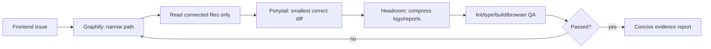

# Frontend Token Trim Skillpack — 日本語

<p align="center">
  
</p>

<p align="center">
  <strong>フロントエンド系エージェントの無駄なトークン消費を減らすワークフロー</strong><br>
  <span>Graphify で経路を絞り · Ponytail で最小変更にし · Headroom で QA 余白を残します</span>
</p>

<p align="center">
  <a href="../README.md">README</a> ·
  <a href="ko.md">한국어</a> ·
  <a href="en.md">English</a> ·
  <a href="#どう動きますか">動作フロー</a> ·
  <a href="benchmark.md">Benchmark</a> ·
  <a href="benchmark-result-controlled.md">Result</a> ·
  <a href="troubleshooting.md">Troubleshooting</a>
</p>

<p align="center">
  
  
  
  
  
</p>

---

## 一言でいうと

**Ponytail + Graphify + Headroom** を組み合わせ、フロントエンド系エージェントが **読む量を減らし、変更量を減らし、検証をより正確にする** ための Hermes Agent スキルパックです。

<table>
<tr>
<td width="33%">

### Graphify

実装前に小さなコード経路を作ります。

```txt
route → component → data/style → QA
```

</td>
<td width="33%">

### Ponytail

既存コードと既存パターンを優先します。

```txt
existing first → smallest diff
```

</td>
<td width="33%">

### Headroom

ログ・報告を圧縮し、QA 用のコンテキストを残します。

```txt
evidence > long summary
```

</td>
</tr>
</table>

## クイックスタート

### Hermes Agent

```bash
git clone https://github.com/kimyoungwopo/frontend-token-trim-skillpack.git
cd frontend-token-trim-skillpack
./install.sh
```

あとで同じ clone から更新する場合:

```bash
./update.sh
```

`update.sh` は repo を `git pull --ff-only` で更新し、その後 `install.sh` を再実行します。既存のインストール済みスキルは active skills ディレクトリ外の `~/.hermes/skill-backups/frontend-token-trim/` に timestamp backup として残ります。

新しい Hermes セッションで次のように依頼します。

```txt
frontend-token-trim を適用して、このフロントエンド issue を修正してください。
```

### Codex / Claude / OpenClaude

プロジェクトルートに対応する rule file をコピーします。

```bash
# Codex / OpenAI coding agents
cp templates/AGENTS.md /path/to/your-project/AGENTS.md

# Claude Code / Claude-style agents
cp templates/CLAUDE.md /path/to/your-project/CLAUDE.md

# OpenClaude / OpenClaude-style agents
cp templates/OPENCLAUDE.md /path/to/your-project/OPENCLAUDE.md
```

## どう動きますか？

<p align="center">
  
</p>



| ステップ | エージェントの動き | トークン削減効果 |
|---|---|---|
| 1. Issue intake | route、画面文言、screenshot、error、component の手がかりを拾う | ぼんやりした repo 探索を防ぐ |
| 2. Graphify | `route → component → hook/API/state → style/token → QA target` を作る | 読むファイル数を減らす |
| 3. Ponytail | 既存 component/hook/token を再利用し、局所 patch する | 変更ファイル数を減らす |
| 4. Headroom | 検索結果、ログ、diff、最終報告を圧縮する | QA/修正用コンテキストを残す |
| 5. Verify | 必要な最小チェックと 320/390px visual QA を行う | トークン削減が検証省略にならない |
| 6. Repair loop | 失敗したら広げず、経路をもう一度絞る | 再試行トークンの膨張を防ぐ |

## 何が良くなりますか？

| トークンが無駄になる箇所 | このスキルパックの対応 |
|---|---|
| 実際の経路を見つける前に `app/`, `components/`, `lib/` を広く読む | route/copy/class 検索で狭い経路を先に作る |
| 既存 component/hook/token を見落として新しく作る | 既存プロジェクトパターンを優先する |
| 小さな UI 修正が大きなリファクタになる | 実際の flow を直す最小ファイルだけ触る |
| 検索結果・ログ・diff が長くなりすぎる | ファイルマップと重要な証拠だけに圧縮する |
| モバイル QA 前にコンテキストが足りなくなる | 320/390px 検証用の headroom を残す |

## 制御ベンチマーク

<p align="center">
  <strong>局所的な mobile overflow task での結果</strong>
</p>

| モード | 推定トークン | 読んだファイル | 変更ファイル | 検証 |
|---|---:|---:|---:|---|
| 通常 baseline | 2,489 | 38 | 1 | lint, 390px browser |
| Frontend Token Trim | 496 | 4 | 1 | lint, 320px + 390px browser |

<p align="center">
  
</p>

詳しい方法:

- [Token Usage Benchmark](benchmark.md)
- [Controlled Benchmark Result](benchmark-result-controlled.md)

自分で推定する場合:

```bash
python3 scripts/estimate_tokens.py baseline-transcript.txt token-trim-transcript.txt
```

> 実際の課金トークンは model/tokenizer によって変わります。可能であれば provider または agent usage log を基準にしてください。

## インストールされるスキル

| スキル | 役割 | 防ぐもの |
|---|---|---|
| [`ponytail`](../skills/software-development/ponytail/SKILL.md) | 最小の正しい実装 | 過剰設計、新規依存、不要な抽象化 |
| [`graphify`](../skills/software-development/graphify/SKILL.md) | コード経路の絞り込み | repo-wide browsing、間違った層の修正 |
| [`headroom`](../skills/software-development/headroom/SKILL.md) | コンテキスト/出力予算管理 | 長いログ、長文報告、QA 余白不足 |
| [`frontend-token-trim`](../skills/software-development/frontend-token-trim/SKILL.md) | 3スキル統合 frontend loop | 焦点のぼけた frontend 作業ループ |

## 更新方法

| 対象 | 自動化 | 安全策 |
|---|---|---|
| ユーザーのインストール済み pack | git clone 内で `./update.sh` を実行 | 最新 repo pull 後、active skills 外に backup + reinstall |
| upstream `ponytail` 変更 | GitHub Action が週1回確認し sync PR を作成 | prompt の挙動が変わる可能性があるため review 後に merge |
| `graphify` / `headroom` / `frontend-token-trim` | この repo で直接更新 | 次回 `./update.sh` に含まれる |

完全な無レビュー auto-merge はしません。スキル文面の変更はエージェントの動きに影響するため、PR で確認してから取り込む方式にしています。

## モデル / エージェント対応

| 環境 | 対応 | 適用方法 |
|---|---|---|
| Hermes Agent | Native skillpack | `./install.sh` |
| OpenAI Codex / Codex CLI | Repo rules | `templates/AGENTS.md` |
| Claude Code / Claude-style | Repo rules | `templates/CLAUDE.md` |
| OpenClaude / OpenClaude-style | Repo rules | `templates/OPENCLAUDE.md` |
| Gemini-style coding agents | Prompt-compatible | `templates/frontend-token-trim.md` を貼る |
| OpenCode / terminal agents | Prompt-compatible | contract + 検証コマンドを明記 |
| Tool なし chat model | Limited | チェックリストとしては有用、自動検証は限定的 |

## Portable contract

```txt
Apply Frontend Token Trim:
1) Graphify the narrow route/component/data/style path first.
2) Reuse existing components, hooks, API clients, styles, and tokens.
3) No new dependencies or broad refactors unless the current path proves they are necessary.
4) Touch the fewest files that fix the real flow.
5) Verify exact affected route plus 320/390 mobile overflow; include command/screenshot evidence.
6) Final report: changed files, verification result, remaining risk only.
```

## ドキュメントと運用

| ドキュメント | 用途 |
|---|---|
| [Agent setup](agent-setup.md) | Hermes, Codex, Claude, OpenClaude の適用方法 |
| [Examples](examples.md) | そのまま使える frontend prompt 例 |
| [Troubleshooting](troubleshooting.md) | install、update、重複 skill、template 問題の解決 |
| [Update policy](update-policy.md) | `update.sh` と upstream sync PR の仕組み |
| [Changelog](../CHANGELOG.md) | release history |
| [Contributing](../CONTRIBUTING.md) | PR rules and validation checklist |
| [Security](../SECURITY.md) | secret/credential handling and security report scope |

## 注意

- トークン削減は検証省略ではありません。
- accessibility、auth/permission、data integrity、lint/type/build/test は引き続き必要です。
- 視覚作業では browser + 320/390px mobile QA まで確認して初めて意味があります。
