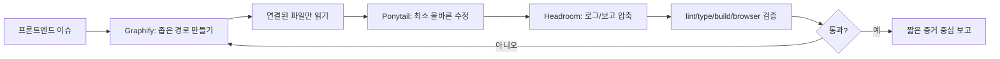

# Frontend Token Trim Skillpack — 한국어

<p align="center">
  
</p>

<p align="center">
  <strong>프론트엔드 에이전트의 토큰 낭비를 줄이는 작업 흐름</strong><br>
  <span>Graphify로 경로를 좁히고 · Ponytail로 최소 수정하고 · Headroom으로 QA 여유를 남깁니다</span>
</p>

<p align="center">
  <a href="../README.md">README</a> ·
  <a href="en.md">English</a> ·
  <a href="ja.md">日本語</a> ·
  <a href="#어떻게-돌아가나요">동작 플로우</a> ·
  <a href="benchmark.md">Benchmark</a> ·
  <a href="benchmark-result-controlled.md">Result</a> ·
  <a href="troubleshooting.md">Troubleshooting</a>
</p>

<p align="center">
  
  
  
  
  
</p>

---

## 한 줄 요약

**Ponytail + Graphify + Headroom**을 합쳐서 프론트엔드 에이전트가 **덜 읽고, 덜 고치고, 더 정확히 검증**하게 만드는 Hermes Agent 스킬팩입니다.

<table>
<tr>
<td width="33%">

### Graphify

작업 전에 실제 코드 경로를 작게 만듭니다.

```txt
route → component → data/style → QA
```

</td>
<td width="33%">

### Ponytail

기존 코드와 패턴을 우선 재사용합니다.

```txt
existing first → smallest diff
```

</td>
<td width="33%">

### Headroom

로그/보고를 압축하고 QA용 컨텍스트를 남깁니다.

```txt
evidence > long summary
```

</td>
</tr>
</table>

## 빠른 설치

### Hermes Agent

```bash
git clone https://github.com/kimyoungwopo/frontend-token-trim-skillpack.git
cd frontend-token-trim-skillpack
./install.sh
```

이후 같은 clone에서 업데이트하려면:

```bash
./update.sh
```

`update.sh`는 repo를 `git pull --ff-only`로 최신화한 뒤 `install.sh`를 다시 실행합니다. 기존 설치본은 active skills 디렉터리 밖의 `~/.hermes/skill-backups/frontend-token-trim/`에 timestamp backup으로 남습니다.

새 Hermes 세션에서 이렇게 사용합니다.

```txt
frontend-token-trim 적용해서 이 프론트엔드 이슈 고쳐줘.
```

### Codex / Claude / OpenClaude

프로젝트 루트에 맞는 rule 파일을 복사합니다.

```bash
# Codex / OpenAI coding agents
cp templates/AGENTS.md /path/to/your-project/AGENTS.md

# Claude Code / Claude-style agents
cp templates/CLAUDE.md /path/to/your-project/CLAUDE.md

# OpenClaude / OpenClaude-style agents
cp templates/OPENCLAUDE.md /path/to/your-project/OPENCLAUDE.md
```

## 어떻게 돌아가나요?

<p align="center">
  
</p>



| 단계 | 에이전트 행동 | 토큰 절감 효과 |
|---|---|---|
| 1. 이슈 입력 | route, 화면 문구, screenshot, error, component 단서만 잡음 | 막연한 repo 탐색 방지 |
| 2. Graphify | `route → component → hook/API/state → style/token → QA target` 맵 작성 | 읽는 파일 수 감소 |
| 3. Ponytail | 기존 component/hook/token 재사용 후 로컬 패치 | 수정 파일 수 감소 |
| 4. Headroom | 검색결과, 로그, diff, 최종 보고 압축 | QA/수정용 컨텍스트 확보 |
| 5. Verify | 필요한 최소 검사와 320/390px 시각 QA 수행 | 토큰 절감이 검증 생략으로 변질되는 것 방지 |
| 6. Repair loop | 실패하면 무작정 더 읽지 않고 경로를 다시 좁힘 | 재시도 토큰 폭증 방지 |

## 무엇이 좋아지나요?

| 토큰이 새는 지점 | 이 스킬팩의 대응 |
|---|---|
| 실제 경로를 찾기 전에 `app/`, `components/`, `lib/`를 넓게 읽음 | route/copy/class 검색으로 좁은 경로부터 만듦 |
| 기존 컴포넌트/훅/토큰을 못 보고 새로 만듦 | 기존 프로젝트 패턴을 우선 재사용 |
| 작은 UI 수정이 큰 리팩터링으로 커짐 | 현재 플로우를 고치는 최소 파일만 수정 |
| 검색결과·로그·diff를 그대로 길게 붙임 | 파일 맵과 핵심 증거만 압축 |
| 모바일 QA 전에 컨텍스트가 부족해짐 | 320/390px 검증용 headroom 확보 |

## 통제 벤치마크

<p align="center">
  <strong>지역화된 모바일 overflow 작업 기준</strong>
</p>

| 모드 | 추정 토큰 | 읽은 파일 | 수정 파일 | 검증 |
|---|---:|---:|---:|---|
| 일반 baseline | 2,489 | 38 | 1 | lint, 390px browser |
| Frontend Token Trim | 496 | 4 | 1 | lint, 320px + 390px browser |

<p align="center">
  
</p>

자세한 내용:

- [Token Usage Benchmark](benchmark.md)
- [Controlled Benchmark Result](benchmark-result-controlled.md)

직접 추정하려면:

```bash
python3 scripts/estimate_tokens.py baseline-transcript.txt token-trim-transcript.txt
```

> 실제 청구 토큰은 모델/토크나이저별로 다를 수 있습니다. 가능하면 provider 또는 agent usage log를 기준으로 보세요.

## 설치되는 스킬

| 스킬 | 역할 | 막아주는 것 |
|---|---|---|
| [`ponytail`](../skills/software-development/ponytail/SKILL.md) | 최소 올바른 구현 | 과설계, 새 dependency, 불필요한 abstraction |
| [`graphify`](../skills/software-development/graphify/SKILL.md) | 코드 경로 좁히기 | repo-wide browsing, 잘못된 레이어 수정 |
| [`headroom`](../skills/software-development/headroom/SKILL.md) | 컨텍스트/출력 예산 관리 | 긴 로그, 장문 보고, QA 여유 부족 |
| [`frontend-token-trim`](../skills/software-development/frontend-token-trim/SKILL.md) | 세 스킬 통합 프론트엔드 루프 | 산만한 프론트엔드 작업 루프 |

## 업데이트 방식

| 대상 | 자동화 | 안전장치 |
|---|---|---|
| 사용자 설치본 | git clone 안에서 `./update.sh` 실행 | 최신 repo pull 후 active skills 밖에 backup + reinstall |
| upstream `ponytail` 변경 | GitHub Action이 주 1회 확인 후 sync PR 생성 | prompt 동작 변경 가능성이 있어 사람 review 후 merge |
| `graphify` / `headroom` / `frontend-token-trim` | 이 repo에서 직접 업데이트 | 다음 `./update.sh`에 포함 |

완전 무검토 자동 merge는 하지 않습니다. 스킬 문구 변경은 에이전트 행동을 바꿀 수 있어서 PR로 확인하는 쪽이 안전합니다.

## 모델/에이전트 지원

| 환경 | 지원 | 적용 방법 |
|---|---|---|
| Hermes Agent | Native skillpack | `./install.sh` |
| OpenAI Codex / Codex CLI | Repo rules | `templates/AGENTS.md` |
| Claude Code / Claude-style | Repo rules | `templates/CLAUDE.md` |
| OpenClaude / OpenClaude-style | Repo rules | `templates/OPENCLAUDE.md` |
| Gemini-style coding agents | Prompt-compatible | `templates/frontend-token-trim.md` 붙여넣기 |
| OpenCode / terminal agents | Prompt-compatible | contract + 검증 명령 명시 |
| Tool 없는 chat model | Limited | 체크리스트로만 유용, 자동 검증 제한 |

## 휴대용 contract

```txt
Apply Frontend Token Trim:
1) Graphify the narrow route/component/data/style path first.
2) Reuse existing components, hooks, API clients, styles, and tokens.
3) No new dependencies or broad refactors unless the current path proves they are necessary.
4) Touch the fewest files that fix the real flow.
5) Verify exact affected route plus 320/390 mobile overflow; include command/screenshot evidence.
6) Final report: changed files, verification result, remaining risk only.
```

## 문서와 운영

| 문서 | 용도 |
|---|---|
| [Agent setup](agent-setup.md) | Hermes, Codex, Claude, OpenClaude 적용법 |
| [Examples](examples.md) | 바로 복사해서 쓸 수 있는 프론트엔드 요청 예시 |
| [Troubleshooting](troubleshooting.md) | 설치, 업데이트, 중복 스킬, 템플릿 문제 해결 |
| [Update policy](update-policy.md) | `update.sh`와 upstream sync PR 방식 설명 |
| [Changelog](../CHANGELOG.md) | 릴리스 히스토리 |
| [Contributing](../CONTRIBUTING.md) | PR 규칙과 검증 체크리스트 |
| [Security](../SECURITY.md) | secret/credential 처리와 보안 제보 범위 |

## 주의

- 토큰 절감은 검증 생략이 아닙니다.
- 접근성, 인증/권한, data integrity, lint/type/build/test는 여전히 필요합니다.
- 시각 작업은 browser + 320/390px 모바일 QA까지 확인해야 의미 있습니다.
